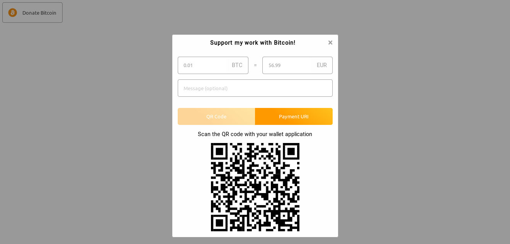

# Cryptotip



Donation button for cryptocurrencies.


## Usage

1. import the css and js files

```html
<head>
    ...
    <link rel="stylesheet" type="text/css" href="https://cdn.rawgit.com/vincentdnl/Cryptotip/master/build/static/css/main.d51372de.css">
    ...
</head>
<body>
    ...
    <!-- Here goes the div --> 
    <script src="https://cdn.rawgit.com/vincentdnl/Cryptotip/master/build/static/js/main.84eed617.js"></script>
    ...
</body>
```

2. create your donation box widget

```html
<div
        id="cryptotip"
        data-bitcoin-address="3CahdmxRvrCiZVZLMpFchbDMVsdLyu69uF"
        data-bitcoin-label="My donation address"
        data-modal-title="Support my work with Bitcoin!"
></div>
```

## Reference

* `data-bitcoin-address`: your bitcoin address
* `data-bitcoin-label`: the label in the donation uri (see: [BIP-0021](https://github.com/bitcoin/bips/blob/master/bip-0021.mediawiki))
* `data-modal-title`: the title that will be displayed on the modal

## Licenses

See [LICENSE.md](LICENSE.md)

Icons are under Creative Commons Attribution 4.0: [https://fontawesome.com/license](https://fontawesome.com/license)
